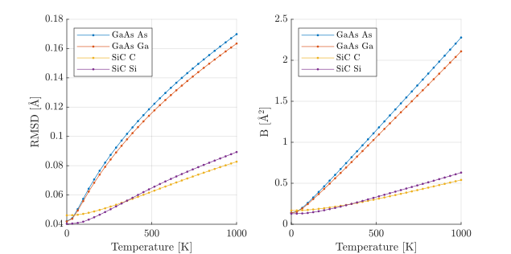

# rmsd_parameterization
Matlab implementation of Cao, H. X., &amp; Peng, L. M. (1999).  Parameterization of the temperature dependence of the Debye-Waller factors

This class provides a convenient way to estimate Debye-Waller
factors (B) and root mean squared displacements (u) for many 
elemental Crystals and some Compounds. It is using the data and formulas of:
Cao, H. X., & Peng, L. M. (1999). 
Parameterization of the temperature dependence of the Debye-Waller factors. 
Acta Crystallographica Section A: Foundations of Crystallography, 55(5), 926–932. 
https://doi.org/10.1107/s0108767399005176

The class has two public functions:
```matlab
tfm_rmsd.plot_DW_T   % Plot B and u over T for a given crystal
tfm_rmsd.rmsd_at_T   % Return B and u for a crystal at given temperature
```


## tfm_rmsd.rmsd_at_T 
Returns the root mean squared displacement u, the Debye-Waller factor B and the lattice type for a set of given Crystals and Temperatures (in Kelvin)
            
### Syntax:
```matlab
[u, B, st] = tfm_rmsd.rmsd_at_T(crystal,T)
[u, B, st] = tfm_rmsd.rmsd_at_T({crystl1, crystal2, ...}, [T1, T2, ...])
 ```           
### Examples:
```matlab
[u, B, st] = tfm_rmsd.rmsd_at_T('Fe',290)
u =
  0.0654
  0.0850
B =
  0.3379
  0.5706
st = 
  {'Fe B.c.c.'}
  {'Fe F.c.c.'}
            
[u, B, s] = tfm_rmsd.rmsd_at_T({'ZnS','ZnTe'},100:100:400)
u =
  0.0636    0.0816    0.0972    0.1112
  0.0646    0.0867    0.1048    0.1206
  0.0660    0.0909    0.1107    0.1276
  0.0790    0.1078    0.1310    0.1509
B =
  0.3195    0.5251    0.7463    0.9768
  0.3297    0.5933    0.8674    1.1476
  0.3444    0.6528    0.9672    1.2849
  0.4933    0.9184    1.3545    1.7969
s =
  {'ZnS S'  }
  {'ZnS Zn' }
  {'ZnTe Te'}
  {'ZnTe Zn'}
  ```
## tfm_rmsd.plot_DW_T(crystal, T_range)
Plots the root mean squared displacement u,
and the Debye-Waller factor B for a given set of crystals 
and (optional) Temperature range (in Kelvin) and (optionally)
returns the figure handle.

### Syntax:
```matlab
  tfm_rmsd.plot_DW_T(crystl, [T_min T_max])
  tfm_rmsd.plot_DW_T({crystl1, crystal2, ...}, [T_min T_max])
```
### Examples:
```matlab
  tfm_rmsd.plot_DW_T('Pt')
  tfm_rmsd.plot_DW_T('Pt', [290 600])
  tfm_rmsd.plot_DW_T({'GaAs','SiC'})
```

